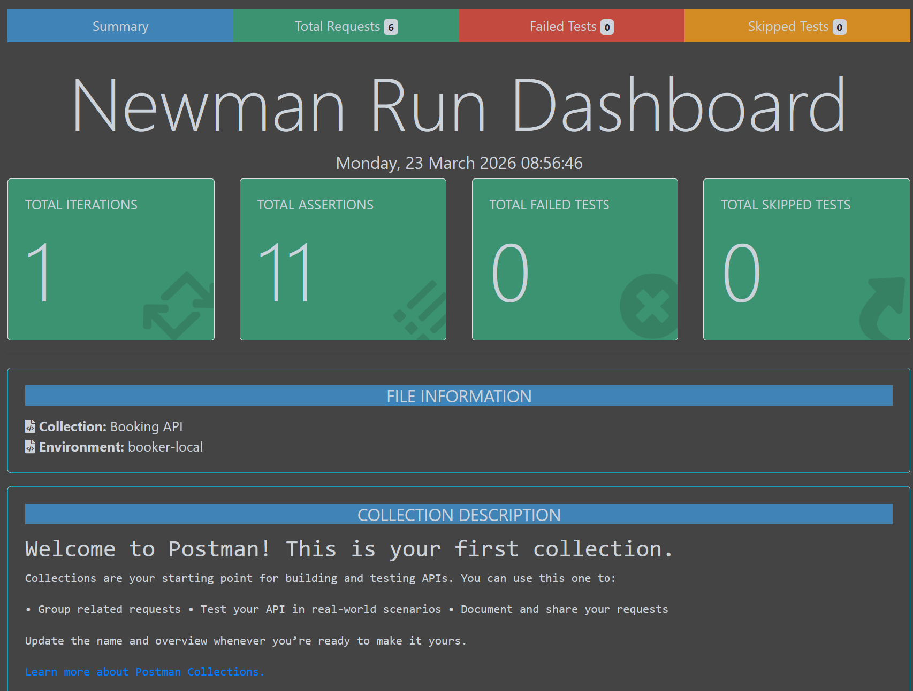

# Restful Booker API Testing

[](https://github.com/Andrew-ptit/restful-booker-api-testing/actions/workflows/api-tests.yml)

API automation testing project for **Restful Booker** using **Postman**, **Newman**, **Docker**, and **GitHub Actions**.

## What I built

- Automated API tests for authentication and booking workflow
- Used collection variables for request chaining (`token`, `bookingId`)
- Added response checks for status code and booking data structure
- Generated HTML test reports with Newman
- Integrated automated execution into GitHub Actions CI
- Added 30+ assertions to validate status codes, response time, headers, required fields, data types, and booking payload consistency

## Coverage

- Create auth token
- Create booking
- Get all bookings
- Get booking by ID
- Update booking
- Delete booking

## Result

- Automated the core booking lifecycle from auth to delete
- Created reusable HTML execution reports as test evidence
- Enabled CI test runs on push, pull request, and manual trigger
- Supported local execution with Docker and Newman

## Test Metrics

- Total API requests: 6
- Total test scripts: 6
- Total assertions: 30+
- Workflow covered: Auth → Create Booking → Get All → Get By ID → Update → Delete

## Test Report



## Tech Stack

Postman · Newman · Node.js · Docker · GitHub Actions · HTML Extra Reporter

## Highlights

- Automated 6 API requests covering authentication and booking flow
- Used request chaining with `token` and `bookingId`
- Validated response status and booking response structure
- Generated HTML execution reports
- Ran tests in CI with GitHub Actions

## Covered Flow

**Auth → Create Booking → Get All → Get By ID → Update → Delete**

## Run

```bash
docker compose up -d
npm install
npm test
npm run test:report
